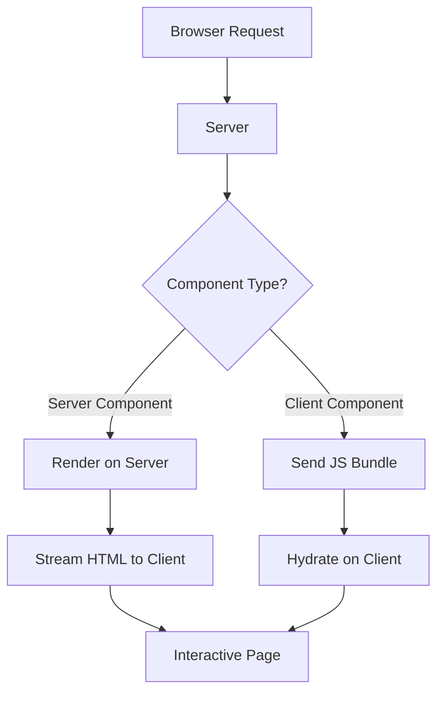

## Introduction

React Server Components (RSC) represent a paradigm shift in how we build React applications. By moving the component rendering logic to the server, we can significantly reduce the amount of JavaScript sent to the client.

## Key Benefits

- Zero bundle size for server components
- Direct access to backend resources
- Automatic code splitting

## Server vs Client Components

| Feature | Server Component | Client Component |
|---|---|---|
| Bundle size | Zero JS shipped | Included in bundle |
| Data access | Direct DB/API access | Needs fetch/useEffect |
| Interactivity | None (static) | Full (state, events) |
| Rendering | Server only | Server + Client |
| Use cases | Data display, layouts | Forms, animations |

## Example

```jsx
// Example Server Component
async function Note({ id }) {
  const note = await db.notes.get(id);
  return (
    <div>
      <h1>{note.title}</h1>
      <section>{note.body}</section>
    </div>
  );
}
```

This allows us to write components that fetch data directly without needing `useEffect` or external data fetching libraries on the client.

## Architecture Overview



> **Note:** RSCs are not a replacement for SSR — they complement it by allowing granular control over what runs on the server versus the client.
