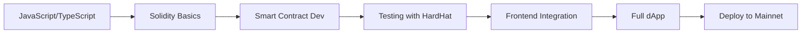

## The Transition

Moving from traditional web development to blockchain doesn't require starting from scratch. Your existing JavaScript and TypeScript skills form a strong foundation for building dApps.

## Key Concepts to Learn

- Smart Contracts and Solidity
- Web3.js and Ethers.js libraries
- Decentralized storage (IPFS)
- Token standards (ERC-20, ERC-721)

## Learning Roadmap



## Web2 vs Web3 Stack Comparison

| Layer | Web2 | Web3 |
|---|---|---|
| Frontend | React, Next.js | React + ethers.js |
| Backend | Node.js, Express | Smart Contracts (Solidity) |
| Database | PostgreSQL, MongoDB | Blockchain State, IPFS |
| Auth | JWT, OAuth | Wallet Connect, MetaMask |
| Hosting | AWS, Vercel | IPFS, Arweave |
| Payments | Stripe, PayPal | Native crypto transfers |

## Getting Started with Solidity

```solidity
// SPDX-License-Identifier: MIT
pragma solidity ^0.8.19;

contract SimpleStorage {
    uint256 private storedValue;

    event ValueChanged(uint256 newValue);

    function set(uint256 value) public {
        storedValue = value;
        emit ValueChanged(value);
    }

    function get() public view returns (uint256) {
        return storedValue;
    }
}
```

The blockchain ecosystem is rapidly evolving, and developers who bridge the gap between traditional web and Web3 are in high demand.

> **Tip:** Start with Ethereum and Solidity — the ecosystem has the most resources, tooling, and job opportunities for newcomers.
