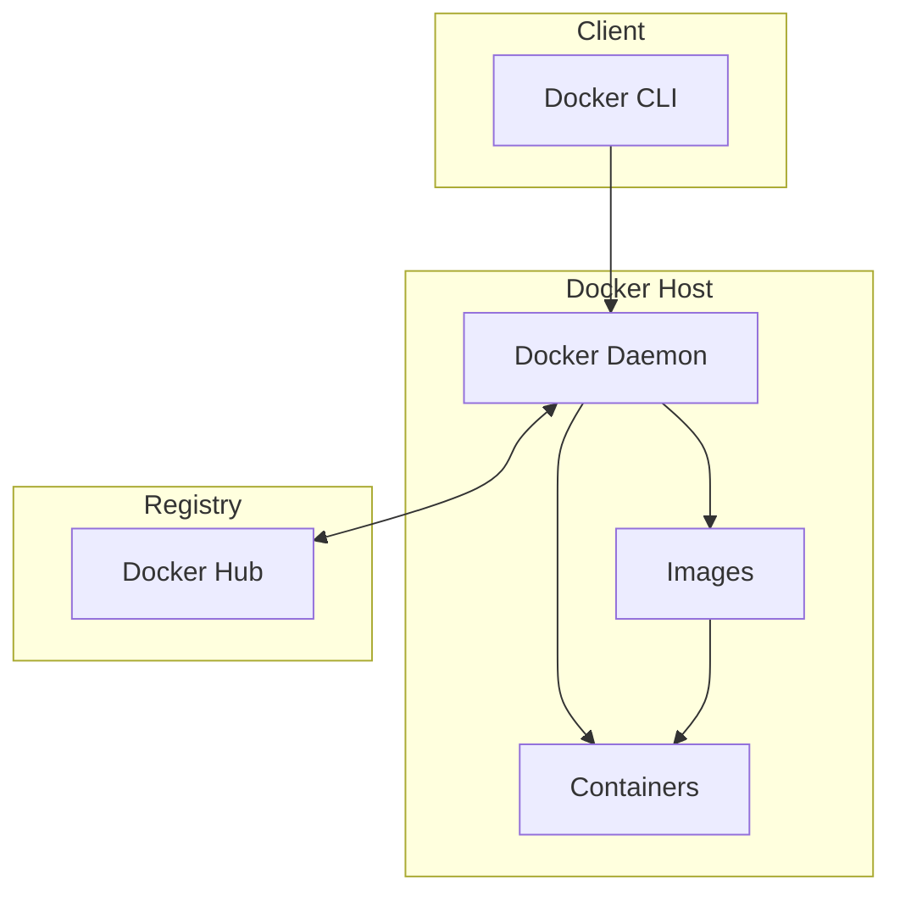

## What is Docker?

Docker is a platform for developing, shipping, and running applications inside containers. Think of containers as lightweight, standalone packages that include everything needed to run your code.

## Core Concepts

- **Images** — Read-only templates used to create containers
- **Containers** — Running instances of images
- **Dockerfiles** — Scripts that define how to build an image
- **Docker Compose** — Tool for defining multi-container apps
- **Volumes** — Persistent data storage for containers

## Docker Architecture



## Images vs Containers

| Aspect | Image | Container |
|---|---|---|
| State | Immutable | Mutable (runtime) |
| Storage | Layered filesystem | Read-write layer on top |
| Lifecycle | Built once, used many times | Created, started, stopped, deleted |
| Analogy | Class definition | Instance of a class |

## Example Dockerfile

```dockerfile
# Multi-stage build for a Node.js app
FROM node:20-alpine AS builder
WORKDIR /app
COPY package*.json ./
RUN npm ci
COPY . .
RUN npm run build

FROM node:20-alpine AS runner
WORKDIR /app
COPY --from=builder /app/dist ./dist
COPY --from=builder /app/node_modules ./node_modules
EXPOSE 3000
CMD ["node", "dist/index.js"]
```

## Docker Compose Example

```yaml
version: '3.8'
services:
  app:
    build: .
    ports:
      - "3000:3000"
    environment:
      - DATABASE_URL=postgres://user:pass@db:5432/mydb
    depends_on:
      - db

  db:
    image: postgres:16-alpine
    volumes:
      - pgdata:/var/lib/postgresql/data
    environment:
      - POSTGRES_PASSWORD=pass

volumes:
  pgdata:
```

Understanding Docker fundamentals transforms how you think about deployment and development environments.

> **Pro tip:** Always use multi-stage builds to keep your production images small. The builder stage compiles your code, but only the final artifacts are copied to the runner stage.
