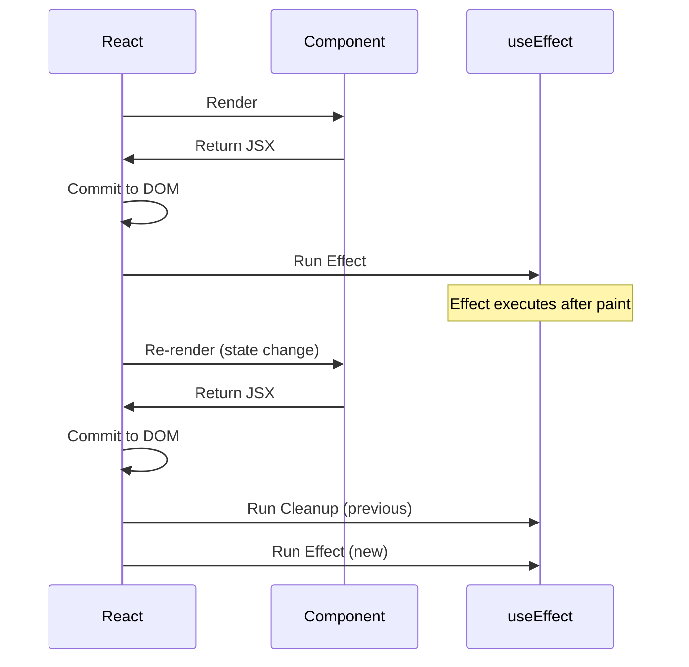

## The useEffect Hook

`useEffect` is one of the most powerful and commonly misused hooks in React. Understanding when and how effects run is crucial for building performant applications.

## Key Patterns

- Dependency arrays and re-runs
- Cleanup functions for subscriptions
- Avoiding infinite loops
- Data fetching patterns

## Effect Lifecycle



## Dependency Array Cheat Sheet

| Dependency Array | When Effect Runs |
|---|---|
| Not provided | After every render |
| `[]` (empty) | Only on mount |
| `[a, b]` | When `a` or `b` changes |

## Common Patterns

### Data Fetching

```tsx
function UserProfile({ userId }: { userId: string }) {
  const [user, setUser] = useState<User | null>(null);
  const [loading, setLoading] = useState(true);

  useEffect(() => {
    let cancelled = false;

    async function fetchUser() {
      setLoading(true);
      const res = await fetch(`/api/users/${userId}`);
      const data = await res.json();

      if (!cancelled) {
        setUser(data);
        setLoading(false);
      }
    }

    fetchUser();

    // Cleanup: prevent state updates on unmounted component
    return () => {
      cancelled = true;
    };
  }, [userId]);

  if (loading) return <Spinner />;
  return <div>{user?.name}</div>;
}
```

### Event Listeners

```tsx
useEffect(() => {
  function handleResize() {
    setWidth(window.innerWidth);
  }

  window.addEventListener('resize', handleResize);

  // Always clean up event listeners
  return () => window.removeEventListener('resize', handleResize);
}, []);
```

### Subscriptions

```tsx
useEffect(() => {
  const subscription = dataSource.subscribe((data) => {
    setData(data);
  });

  return () => subscription.unsubscribe();
}, [dataSource]);
```

## Common Pitfalls

1. **Missing dependencies** — ESLint's `exhaustive-deps` rule catches this
2. **Object/array dependencies** — Use `useMemo` to stabilize references
3. **Infinite loops** — Setting state that's also a dependency
4. **Race conditions** — Use cleanup flags or `AbortController`

> Mastering `useEffect` means understanding the React component lifecycle and how side effects interact with the rendering process.
